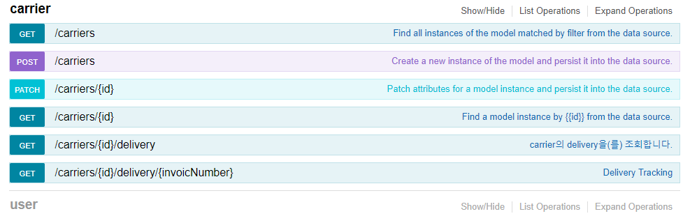

# Delivery Tracker
Delivery Tracking Service

## Overview
Created for personal project purpose 

  * Support for inquiring the details of Korean parcels (cj logistics,hanjin,epost)
  * Support for user service (registration, login etc..)
  * Admin page implementation
  * Provide real-time tracking service(Beta)

## Usage
Created based on node version 8.

#### Install 
```
git clone https://github.com/gongul/delivery-tracker.git
```

#### Run 
```
npm install

npm start 
```

If not defined npm_config_node_gyp If there is an error like this, correct it by the method below.(Windows)
```
npm install --global --production windows-build-tools 
```

## Example
Examples are not provided separately,<br/>
You'll need to go into the link below and check it out.

#### A test account is created automatically when the server runs.
```javascript
 {"email":"admin@admin.com", "password":"admin", "username":"admin"}
 {"email":"user@user.com", "password":"user", "username":"user"}
```

####  GET localhost/explorer



#### POST localhost/api/users/login (Login API)
##### Request 
```
curl -X POST --header 'Content-Type: application/json' --header 'Accept: application/json' -d '{"email":"admin%40admin.com","password":"admin"}' 'http://localhost/api/users/login'
```
##### Response
```javascript
{
  "id": "OQDU8FMYn44dylqBiQbSLbtwCwmux5VCADuJsvAxniFegPiMA0vM0YBKI1Dcgb58",
  "ttl": 1209600,
  "created": "2019-08-26T09:41:22.985Z",
  "userId": "admin@admin.com"
}
```

#### GET localhost/admin?access_token=?{accessToken} (Admin Page)
##### Request 
```
curl -X GET --header 'Accept: application/json' 'http://localhost/api/users/admin?access_token=OQDU8FMYn44dylqBiQbSLbtwCwmux5VCADuJsvAxniFegPiMA0vM0YBKI1Dcgb58'
```


## Third Project 
##### CornSoupCookie : https://github.com/CornSoupCookie/trackingdelivery
